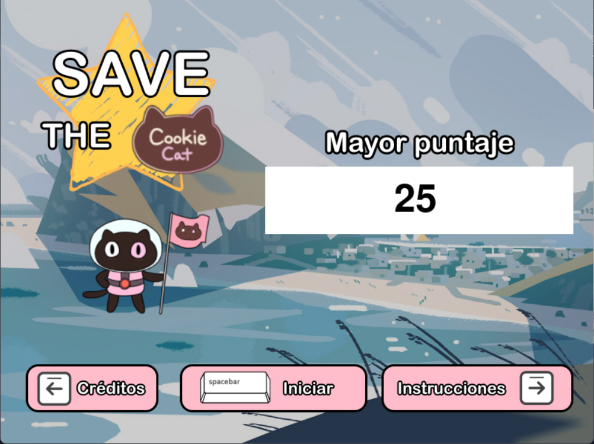
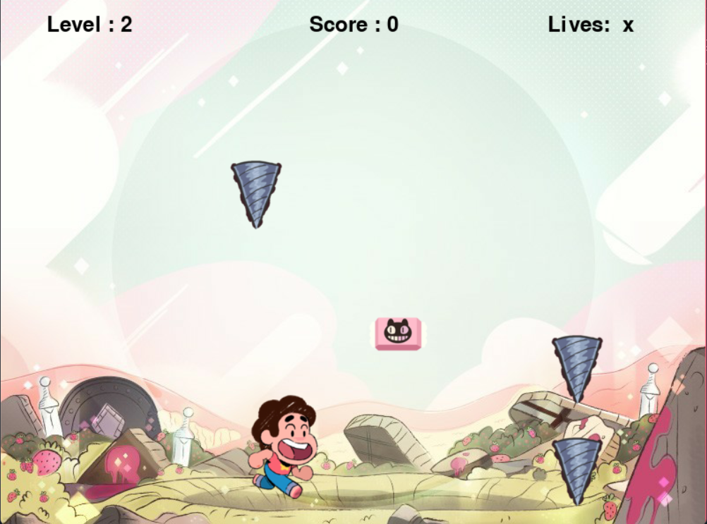

# Save the cookie cat

Recoge todas las gato galletas que puedas mientras esquivas los taladros que caen cada vez más rápido.

## Screenshots




## Requerimientos

Para poder ejecutar 'Save the cookie cat' se requiere la instalación de:

-   Python 3.10 (https://www.python.org/downloads/)
-   PyGame (https://www.pygame.org/wiki/GettingStarted)

## Ejecutar el juego

Para ejecutar este juego, debes abrir tu terminal y posicionarte dentro de este directorio al mismo nivel que el archivo `main.py`.

Una vez en la dirección correcta, ejecutar el comando:

`python main.py`

## Archivos necesarios para ejecución

No es necesario crear algún archivo extra para poder ejecutar este juego.

Ten cuidado de no borrar algún archivo del directorio ya que esto provocaria errores en la ejecución.

Nota: en caso de querer restaurar el puntaje más alto del juego, solo es necesario ir al archivo `game/sources/score.txt` y sobreescribir su contenido por un 0 o dejarlo vacio.

## Configuración

La configuración de los valores del juego se realizan desde el archivo `config.py`.

Estas con las variables encargadas de la jugabilidad y solo esas deben modificarse para evitar acciones inesperadas en el juego:

```python

# Velocidad con la que se mueve el personaje
PLAYER_SPEED = 10

# Número de niveles que deben pasar para aumentar la velocidad con que caen los taladros
LEVEL_TO_INCREASE_SPEED = 5

# Cantidad en la que debe aumentar la velocidad
SPEED_INCREASE = 1

# Velocidad de caída por defecto
FALL_SPEED = 10

# Número de taladros y galletas que deben aparecer por nivel
DRILLS_PER_LEVEL = 8
COOKIES_PER_LEVEL = 5
```

## Información:

-   Desarrollado por: [@Javier57](https://github.com/Javieer57)
-   Fecha de lanzamiento: Mayo 2022
-   Idioma: Español
-   Creado con: Python y PyGame
-   Juego creado como proyecto final del Bootcamp de introducción a la programación impartido por [Codigo fácilito](https://codigofacilito.com)
